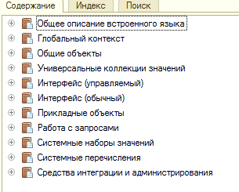

# Парсер файла оглавления синтакс-помощника платформы 1С

## Что делает?
Парсит вот это:

Оглавление представляет собой файл без расширения, лежит в файле `shcntx_root.hbk`, перед парсингом его нужно извлечь. 

## Формат файла содержания
Оглавление синтакс-помощника 1С, представляет собой текстовый файл определенного формата ("скобкофайл").

Каждая страница синтакс-помощника указывается в виде автономного блока (chunk) обрамленного в фигурные скобки.
Файл оглавления содержит в себе количество блоков в файле, затем описание самих блоков, следующих один за другим, без вложенной иерархии.

Каждый блок состоит из (упрощенно):

* порядкового номера текущего блока (id). Нумерация сквозная через весь файл, начинается с нуля;
* номера родительского блока;
* количество дочерних блоков;
* в случае если количество дочерних блоков > 0, перечень номеров дочерних блоков;
* подраздел со свойствами блока:
    * имя (заголовок страницы). Может отсутствовать, может быть указан на одном языке, может быть указан на двух языках;
    * относительный путь к html файлу страницы, который содержит контент страницы. Может быть пустым.

Данный парсер читает файл оглавления и преобразует его в более удобную для работы структуру, в виде класса
`TableOfContent` содержащего рекурсивный список дочерних страниц (`Page`).

## Особенности
Так как файл справки платформы 1С является объектом исключительных прав фирмы 1С, его использование в публичных тестах
представляется затруднительным. Если у вас есть идеи как это можно сделать не нарушая лиц. соглашение, можете написать автору
на почту или сделать PullRequest.

## Лицензия
MIT